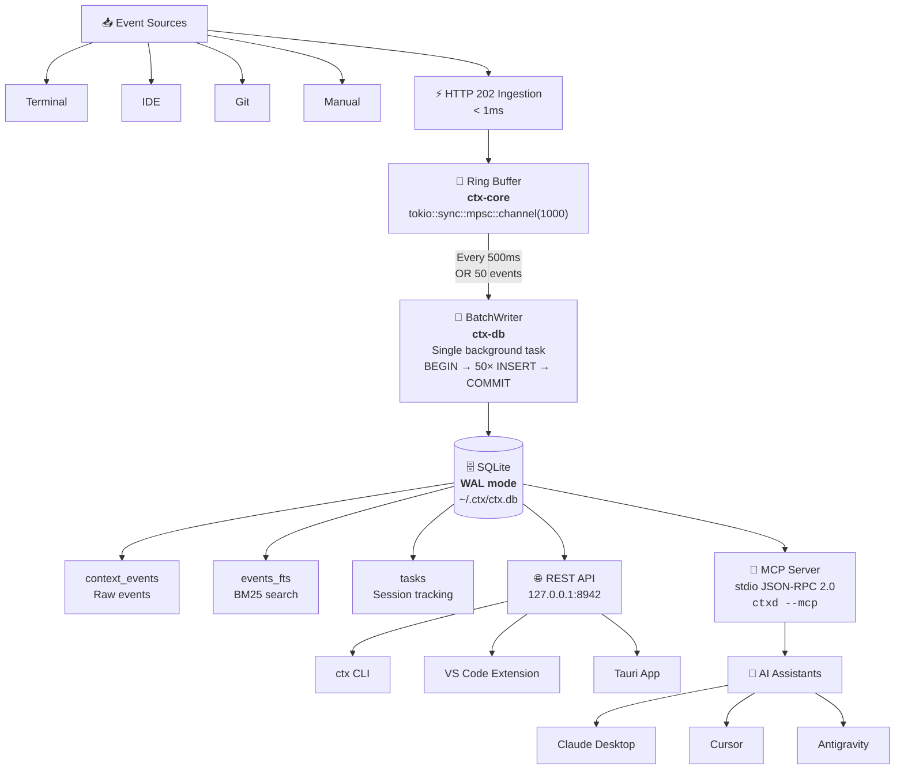

# Contexto — Universal Developer Context Manager

<div align="center">

[](https://github.com/NSTKrishna/Contexto/actions/workflows/ci.yml)
[](LICENSE)
[](https://www.rust-lang.org/)
[](https://www.sqlite.org/)
[](https://modelcontextprotocol.io/)

**The invisible flight recorder for your software engineering workflow.**  
Captures, redacts, indexes, and surfaces your developer context across terminal, IDE, Git, and AI agents.

[Architecture](#-architecture) • [Quickstart](#-quickstart) • [CLI Usage](#-cli-usage) • [MCP for AI](#-mcp-integration-for-ai-assistants) • [REST API](#-rest-api-reference) • [Roadmap](#-roadmap)

</div>

---

## 💡 Why Contexto?

As developers, we switch between terminals, code editors, git branches, browser documentation, and AI assistants hundreds of times a day. Every context switch causes cognitive friction and data loss:

* **Lost Thought Trails:** Why did that test fail 30 minutes ago? What was that exact `curl` invocation or compiler flag?
* **Manual AI Prompting:** Constantly copy-pasting diffs, terminal outputs, and notes into Claude, Cursor, or ChatGPT.
* **PR Writing Friction:** Reconstructing hours of work from scattered git logs when opening a pull request.

**Contexto runs silently as a local daemon on your machine.** It records your commands, file edits, git operations, and notes into an encrypted, local-first SQLite database with sub-millisecond FTS5 search. When you need it, Contexto feeds this rich context directly to your AI agents via the **Model Context Protocol (MCP)** or lets you search it from your terminal via `ctx`.

---

## ✨ Key Features

* **⚡ High-Throughput, Low-Latency Ingestion:** An in-memory ring buffer (`tokio::sync::mpsc::channel(1000)`) receives events via HTTP 202 in **< 1ms**. The background `BatchWriter` flushes writes to SQLite in a single transaction every 500ms or 50 events to eliminate `SQLITE_BUSY` lock contention.
* **🔒 Local-First & Zero Telemetry:** Your data never leaves your machine. No cloud subscriptions, no external tracking, and automatic scrubbing of API keys, tokens, and secrets before disk persistence.
* **🔍 Instant BM25 Search:** SQLite FTS5 inverted indexing delivers sub-2ms full-text search across all captured events with zero external search services.
* **🤖 Native MCP Server (`ctxd --mcp`):** Out-of-the-box support for Claude Desktop, Cursor, Antigravity, and any MCP-compatible AI agent, enabling bidirectional context memory.
* **💻 High-Density CLI (`ctx`):** Fast, ergonomic command-line tool with rich terminal formatting and JSON output support.
* **⏱️ Living Tasks:** Track active coding sessions (`ctx task start <name>`, `ctx task stop`), automatically calculating durations and aggregating events for PR descriptions.
* **🤖 Automated PR Code Reviewer:** GitHub Actions integration ([`docs/PR_REVIEW_BOT.md`](docs/PR_REVIEW_BOT.md)) evaluating PR diffs for correctness, security, data loss, and breaking changes with zero-noise reporting.
* **🎨 Linear / Raycast Developer Dark Design:** Built to the highest visual density and design standards ([`docs/DESIGN.md`](docs/DESIGN.md)) for upcoming VS Code and Tauri desktop integrations.

---

## 🏛 Architecture




### Workspace Structure

| Crate | Purpose |
|---|---|
| [`crates/ctx-core`](crates/ctx-core) | Shared domain models (`ContextEvent`, `EventSource`, `Task`, `EventFilter`), ring buffer channels, and core traits |
| [`crates/ctx-db`](crates/ctx-db) | SQLite connection pooling (WAL mode), embedded SQL migrations, FTS5 virtual tables, and asynchronous `BatchWriter` |
| [`crates/ctxd`](crates/ctxd) | Core background daemon running Axum REST API (`127.0.0.1:8942`), Bearer token security, SSE stream, and MCP stdio transport |
| [`crates/ctx-cli`](crates/ctx-cli) | Terminal client binary (`ctx`) providing status, timeline, search, task management, and manual notes |
| [`extensions/vscode`](extensions/vscode) | Official VS Code extension: automated editor event capture, status bar indicator, and Linear/Raycast dark sidebar webview |

---

## 🚀 Quickstart

### Prerequisites

* **Rust:** Stable toolchain (`1.85+` / Edition 2024 support). Install via [rustup](https://rustup.rs/):
  ```bash
  curl --proto '=https' --tlsv1.2 -sSf https://sh.rustup.rs | sh
  ```
* **macOS / Linux** (Windows supported via WSL2)

### 1. Clone & Build

```bash
git clone https://github.com/NSTKrishna/Contexto.git
cd Contexto

# Build all workspace crates in release mode
cargo build --release
```

### 2. Start the Daemon (`ctxd`)

The daemon runs locally and manages the database, ring buffer, and REST/MCP interfaces:

```bash
cargo run -p ctxd --bin ctxd
```

On first startup, `ctxd`:
1. Creates directory `~/.ctx/` with secure permissions (`0700`).
2. Generates an encrypted 256-bit authentication token in `~/.ctx/auth_token` (`0600`).
3. Runs SQLite migrations and enables WAL mode on `~/.ctx/ctx.db`.
4. Binds the REST server to `127.0.0.1:8942`.

### 3. Use the CLI (`ctx`)

In another terminal window:

```bash
# Check daemon health and active session
./target/release/ctx status

# Record a quick note
./target/release/ctx remember "Switched SQLite to WAL mode for concurrent reads"

# Search captured history
./target/release/ctx search "SQLite WAL"

# View recent context timeline
./target/release/ctx context --limit 10
```

---

## 💻 CLI Usage

The `ctx` CLI reads credentials automatically from `~/.ctx/auth_token`.

```text
Usage: ctx [OPTIONS] <COMMAND>

Commands:
  status   Show the current daemon status, active task, and event count
  context  Print the current context window (recent events)
  remember Manually annotate context with a permanent note
  search   Full-text search across all captured context (FTS5 BM25)
  task     Manage tracked tasks (start, stop, list, abandon)
  help     Print this message or the help of the given subcommand(s)

Options:
      --url <URL>        ctxd REST API URL [env: CTX_REST_URL=] [default: http://127.0.0.1:8942]
      --format <FORMAT>  Output format: pretty | json [default: pretty]
  -h, --help             Print help
  -V, --version          Print version
```

### CLI Examples

#### Tracking a Work Task
```bash
# Start a new task
ctx task start "refactor auth middleware"

# Check active task in status
ctx status

# List all tasks
ctx task list

# Stop task when completed
ctx task stop
```

#### Searching Context
```bash
# Exact term or phrase
ctx search "cargo test"

# FTS5 prefix match
ctx search "migrat*"

# JSON output for piping into jq or scripts
ctx search "auth" --format json | jq .
```

#### Filtering Context Events
```bash
# Filter by source: terminal, editor, git, manual, mcp
ctx context --source manual --limit 5
```

---

## 🧩 VS Code Extension

The official **Contexto VS Code Extension** (`extensions/vscode`) seamlessly connects your editor to `ctxd`:

* **Automatic Event Capture:** Monitors document open, save, selection/cursor moves (debounced), and active editor focus changes.
* **Status Bar Indicator:** Real-time pulse icon indicating daemon connection status, captured event counts, and active task name. Click to toggle capture on/off.
* **Sidebar Activity Bar Panel:** A rich Linear/Raycast Dark UI feed displaying live context events, active tasks, and relative timestamps with zero telemetry.
* **Quick Commands:**
  * `Contexto: Toggle Capture` — Pause or resume editor telemetry recording.
  * `Contexto: Search Context` (`⌘K` inside webview or VS Code command palette) — Fast BM25 full-text search.
  * `Contexto: Remember Note` — Prompt to save a permanent note straight from the editor.
  * `Contexto: Show Daemon Status` — View daemon health, token budget, and database path.

### Development & Installation

```bash
cd extensions/vscode
npm install
npm run compile
```

Press `F5` in VS Code or launch via the **Extension Development Host** to run locally.

---

## 🤖 MCP Integration for AI Assistants

`ctxd` implements Anthropic's **Model Context Protocol (MCP)** over `stdio` using JSON-RPC 2.0. This allows AI tools to automatically pull context and remember key insights during conversations.

### Exposed MCP Tools

| Tool | Parameters | Description |
|---|---|---|
| `get_context` | `limit?: number, source?: string` | Retrieve recent developer events |
| `search_context` | `query: string, limit?: number` | BM25 full-text search across past activity |
| `remember` | `note: string, label?: string` | Store an important decision or insight |
| `get_task` | *none* | Retrieve the currently active task description |

### Configuration

#### Claude Desktop
Add to `~/Library/Application Support/Claude/claude_desktop_config.json`:
```json
{
  "mcpServers": {
    "contexto": {
      "command": "/ABSOLUTE/PATH/TO/Contexto/target/release/ctxd",
      "args": ["--mcp"]
    }
  }
}
```

#### Cursor IDE
Add to `.cursor/mcp.json` (workspace) or `~/.cursor/mcp.json` (global):
```json
{
  "servers": {
    "contexto": {
      "command": "/ABSOLUTE/PATH/TO/Contexto/target/release/ctxd",
      "args": ["--mcp"],
      "transport": "stdio"
    }
  }
}
```

#### Antigravity / AGY
Add to `.agents/mcp_config.json`:
```json
{
  "servers": {
    "contexto": {
      "command": "/ABSOLUTE/PATH/TO/Contexto/target/release/ctxd",
      "args": ["--mcp"],
      "transport": "stdio"
    }
  }
}
```

---

## 🌐 REST API Reference

All requests require the `Authorization: Bearer <TOKEN>` header, where `<TOKEN>` is read from `~/.ctx/auth_token`. The daemon binds strictly to `127.0.0.1:8942`.

| Method | Endpoint | Description |
|---|---|---|
| `GET` | `/status` | Daemon uptime, event count, database path, active task |
| `GET` | `/context?limit=N&source=S` | Fetch recent context events (filterable) |
| `POST` | `/events` | Ingest an event into the ring buffer (returns `202 Accepted`) |
| `GET` | `/events/stream` | Server-Sent Events (SSE) stream of real-time events |
| `GET` | `/search?q=QUERY&limit=N` | FTS5 BM25 search across all indexed events |
| `POST` | `/remember` | Save a manual note / annotation |
| `POST` | `/tasks/start` | Start tracking a new task (`{"name": "..."}`) |
| `POST` | `/tasks/stop` | Complete the currently active task |
| `POST` | `/tasks/abandon` | Abandon the active task |
| `GET` | `/tasks` | List recorded tasks |

### Example cURL Request

```bash
TOKEN=$(cat ~/.ctx/auth_token)

# Ingest an event
curl -X POST http://127.0.0.1:8942/events \
  -H "Authorization: Bearer $TOKEN" \
  -H "Content-Type: application/json" \
  -d '{"source":"terminal","label":"cargo test","content":"test result: ok. 14 passed"}'

# Search indexed events
curl "http://127.0.0.1:8942/search?q=cargo+test" \
  -H "Authorization: Bearer $TOKEN"
```

---

## 🗺️ Roadmap

| Phase | Component | Description | Status |
|:---:|---|---|:---:|
| **0** | **Pre-Codebase Setup** | CI/CD pipelines, Git hooks, architecture & design specs | ✅ Completed |
| **1** | **`ctx-core` + `ctx-db`** | SQLite + WAL mode, FTS5 BM25 search, ring buffer, BatchWriter | ✅ Completed |
| **2** | **`ctxd` Daemon + MCP** | Axum REST API (127.0.0.1:8942), Bearer auth, MCP stdio protocol | ✅ Completed |
| **3** | **`ctx-cli`** | Standalone terminal binary (`ctx status`, `remember`, `search`, `tasks`) | ✅ Completed |
| **4** | **VS Code Extension** | Automatic editor event listener (file saves, diffs, active selections) | ✅ Completed |
| **5** | **Terminal Hook + Redaction** | Shell hook (`.zshrc`/`.bashrc`) capturing commands with secret scrubbing | 🔜 Planned |
| **6** | **Local Embeddings & Vector Search** | Embedded LanceDB + FastEmbed for local semantic similarity search | 🔜 Planned |
| **7** | **Tauri Desktop App** | High-density Linear/Raycast dark UI window with global hotkey | 🔜 Planned |
| **8** | **Distribution & Hardening** | Signed macOS binaries, Homebrew tap, end-to-end integration tests | 🔜 Planned |

---

## 🔒 Security & Privacy

Contexto is built on zero-trust principles for developer telemetry:

1. **Loopback Binding Only:** `ctxd` binds exclusively to `127.0.0.1` and will reject attempts to bind to public interfaces.
2. **Ephemeral Bearer Authentication:** REST endpoints require a cryptographically secure 256-bit token stored in `~/.ctx/auth_token` with `0600` permissions.
3. **Secret Scrubbing (Phase 5):** Pre-ingestion redaction ensures API tokens (`ghp_`, `AWS_SECRET_ACCESS_KEY`, private keys) never hit SQLite storage.
4. **No Unsafe Code:** The entire codebase enforces `#![forbid(unsafe_code)]`.

Read more in [`docs/SECURITY.md`](docs/SECURITY.md).

---

## 🛠 Development & Testing

```bash
# Run all workspace unit and integration tests
cargo test --workspace

# Run Clippy (strictly enforced with zero warnings)
cargo clippy --workspace --all-targets -- -D warnings

# Check code formatting
cargo fmt --all -- --check
```

---

## 📄 License

This project is licensed under the [MIT License](LICENSE).
